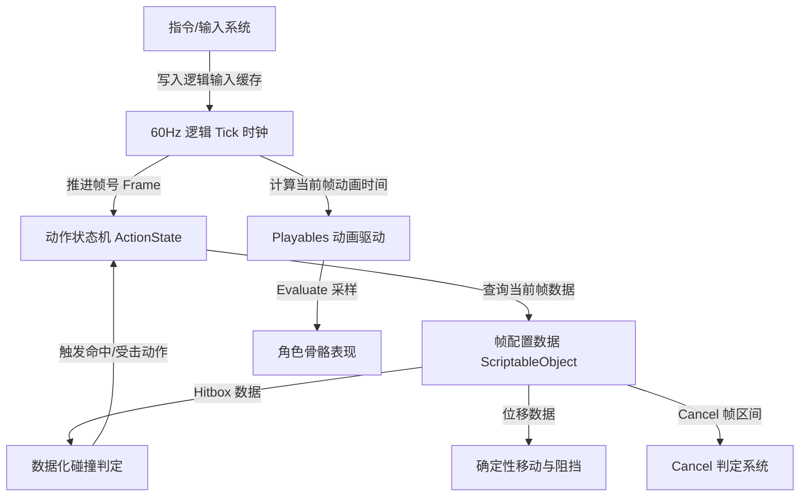

# Unity ACT 动作系统重构规划方案：从“妥协”走向“帧精确与确定性”

本规划方案旨在提供一个分阶段的重构路线图，指导如何将当前基于 Unity Animator 状态机、Update DeltaTime 和百分比时间段的“妥协版”动作系统，重构成业界商业 ACT 游戏通用的**帧精确（Frame-Accurate）、定点逻辑 Tick 驱动、数据化碰撞判定**的“不妥协版”系统。

---

## 📌 重构目标与核心架构设计

重构后的系统将遵循 **“逻辑与渲染分离”** 的原则，架构设计如下：



### 核心改变对比
* **时间单位**：`NormalizedTime (float)` $\rightarrow$ **逻辑帧号 `Frame (int)`**。
* **驱动源**：`Update (DeltaTime)` $\rightarrow$ **固定 60Hz 逻辑 Tick (带 Catch-up 补帧机制)**。
* **动画系统**：`Animator Controller` $\rightarrow$ **`PlayableGraph` (代码手动控制 Sample 进度)**。
* **碰撞检测**：骨骼挂载 Collider $\rightarrow$ **数据配置的 Overlap 几何体碰撞检测**。

---

## 🗺️ 四阶段重构路线图

为保证项目能平稳过渡而不彻底瘫痪，建议按以下四个阶段逐步替换系统模块。

### 阶段一：解耦 Animator Controller，引入 Playables API
**目标**：用代码完全掌控动画的播放进度，解决“顿帧（Freeze）”和“精确对齐”的问题。

1. **移除 Animator 状态机连线**：
   * 删掉 Animator Controller 中复杂的 Transition 连线，仅保留 Animator 组件本身作为表现层骨骼的载体。
2. **实现 PlayableGraph 动画播放器**：
   * 封装 `PlayableManager`，利用 `PlayableGraph` 和 `AnimationClipPlayable` 来动态混合和播放动画。
   * 提供 `PlayAnimation(AnimationClip clip, int startFrame, float fadeLengthSec)` 接口。
3. **实现定点逻辑 Tick 机制**：
   * 在 Update 中通过累加 `Time.deltaTime` 维护一个 `logicAccumulator`。当其大于单个逻辑帧间隔（如 $1/60 \approx 0.0167$ 秒）时，执行一次或多次逻辑 Tick。
   * 动画的采样在逻辑 Tick 中执行：
     $$\text{AnimationTime} = \frac{\text{LogicFrame}}{\text{60.0f}}$$
     然后调用 `playable.SetTime(time)` 和 `playableGraph.Evaluate()` 驱动骨骼更新。

---

### 阶段二：重构动作数据结构，全面转为“帧（Frame）”单位
**目标**：将所有配置表中的浮点百分比区间转为确定的整型帧区间，使连招、硬直及判定更加直观、精确。

1. **修改数据结构配置**：
   * 将 [ActionInfo.cs](file:///C:/project/ACT-Game-Action-System/Assets/Scripts/Character/Action/ActionInfo.cs) 及相关字段（如 `PercentageRange`）重构。例如：
     ```diff
     - public float min; // 0.25f
     - public float max; // 0.50f
     + public int startFrame; // 第 15 帧
     + public int endFrame;   // 第 30 帧
     ```
2. **用帧号改写 Cancel 判定**：
   * 每次逻辑 Tick 中，动作的 `currentFrame` 累加 1。
   * 判定 Cancel 时，直接比对 `currentFrame >= startFrame && currentFrame <= endFrame`，不再需要做复杂的 DeltaTime 跨步区间交叉计算。
3. **改写顿帧与卡肉（Hit Freeze）逻辑**：
   * 当触发顿帧时，逻辑层只需在 Tick 内**暂停累加 `currentFrame`**（或者减少累加计数），动画采样也会自动静止在当前帧，无需频繁将 `Animator.speed` 设为 0。

---

### 阶段三：数据驱动的 Hitbox / Hurtbox 检测系统
**目标**：摆脱对 Unity 物理 Trigger 和骨骼挂载的依赖，实现百分之百确定且与帧同步的碰撞检测。

1. **设计帧数据配置工具（Timeline-like Editor）**：
   * 创建基于 `ScriptableObject` 的动作帧数据资源。
   * 允许策划为每个动作配置：
     * **伤害判定盒 (Hitbox)**：在哪几帧开启，形状（立方体/球体/胶囊体）、尺寸、挂载参考骨骼、位置偏移量。
     * **受击判定盒 (Hurtbox)**：形状、尺寸、受击抗性（霸体/格挡/虚弱等）。
2. **纯数据碰撞检测实现**：
   * 在逻辑 Tick 中，获取当前动作当前帧激活的所有 Hitbox 数据。
   * 计算 Hitbox 结合角色当前 Position 和 Rotation 后的世界空间矩阵（或利用参考骨骼的 Transform 矩阵进行变换）。
   * 使用 `Physics.OverlapBoxNonAlloc` 或自定义数学判定，在逻辑 Tick 中当场算出命中结果，并将受击动作的改变和硬直状态立即在同帧内分发下去。

---

### 阶段四：物理剥离与确定性移动控制
**目标**：实现严丝合缝的位移阻挡和击退效果，保证在网络卡顿或本地顿帧时位置完全可控。

1. **逻辑位移计算**：
   * 废除通过插值公式在 Update 里移动角色的做法，将其合并入逻辑 Tick 中。
   * 每一动作帧配置一个明确的物理位移向量（如第 15 帧移动 `(0.2f, 0, 0)`）。
2. **扫掠测试（Sweep Test）阻挡处理**：
   * 在逻辑 Tick 应用位移前，朝位移方向发射短距离的 BoxCast / Raycast 进行碰撞预测。
   * 如果前方有墙壁，计算可滑动的实际位移，并直接在 Tick 内修改 `transform.position`。

---

## 🛠️ 关键模块伪代码与实现指南

### 1. 逻辑 Tick 时钟与 Catch-up 补帧机制
在 `GameMain.cs` 或角色的管理器中引入自定义逻辑帧循环，解决跳帧问题：

```csharp
public class DeterministicGameLoop : MonoBehaviour
{
    private const float LOGIC_TICK_RATE = 1f / 60f; // 60 FPS 逻辑帧
    private float _logicAccumulator = 0f;
    public int CurrentLogicFrame { get; private set; } = 0;

    void Update()
    {
        // 累加真实流逝时间
        _logicAccumulator += Time.deltaTime;

        // 追赶机制（Catch-up）：在卡顿帧，通过循环多次执行逻辑 Tick 补齐丢失的帧
        int iterations = 0;
        while (_logicAccumulator >= LOGIC_TICK_RATE)
        {
            _logicAccumulator -= LOGIC_TICK_RATE;
            DoLogicTick();
            CurrentLogicFrame++;
            
            // 防死循环保护（比如卡顿时间极长时）
            iterations++;
            if (iterations > 10) 
            {
                _logicAccumulator = 0f; // 丢弃过多积攒的时间，防止爆帧
                break;
            }
        }
        
        // 渲染插值更新（可选，用于处理骨骼过渡平滑度）
        float t = _logicAccumulator / LOGIC_TICK_RATE;
        DoRenderInterpolation(t);
    }

    private void DoLogicTick()
    {
        // 1. 处理输入
        // 2. 更新动作状态与 Frame Count
        // 3. 执行数据化 Hitbox 检测
        // 4. 执行逻辑位移与场景阻挡
        // 5. 驱动 Playables 采样动画
    }
}
```

### 2. 使用 Playables API 精准控制动画播放与顿帧
用以代替原有的 `anim.CrossFade` 和 `anim.speed = 0` 的妥协写法：

```csharp
using UnityEngine;
using UnityEngine.Animations;
using UnityEngine.Playables;

public class FrameAccuratePlayablePlayer : MonoBehaviour
{
    private PlayableGraph _graph;
    private AnimationMixerPlayable _mixer;
    private AnimationClipPlayable _currentPlayable;
    
    public Animator targetAnimator;

    void Awake()
    {
        // 初始化 Playable 树
        _graph = PlayableGraph.Create("ACT_PlayableGraph");
        var output = AnimationPlayableOutput.Create(_graph, "AnimationOutput", targetAnimator);
        _mixer = AnimationMixerPlayable.Create(_graph, 2);
        output.SetSourcePlayable(_mixer);
        _graph.Play();
    }

    public void PlayClip(AnimationClip clip)
    {
        // 销毁旧的可播放项并创建新的
        if (_currentPlayable.IsValid()) _currentPlayable.Destroy();
        _currentPlayable = AnimationClipPlayable.Create(_graph, clip);
        _currentPlayable.SetSpeed(0); // 将动画原生更新速度设为 0，完全由逻辑 Tick 驱动时间

        _graph.Connect(_currentPlayable, 0, _mixer, 0);
        _mixer.SetInputWeight(0, 1.0f);
    }

    // 由 60Hz 逻辑 Tick 调用
    public void UpdateAnimationToFrame(int logicFrame, bool isFreezing)
    {
        if (!_currentPlayable.IsValid()) return;

        // 如果在硬直/顿帧中，时间不再前进，动画直接锁定在当前帧
        if (isFreezing) return; 

        // 计算精确的时间戳
        double animationTime = logicFrame / 60.0;
        _currentPlayable.SetTime(animationTime);
        
        // 强制采样，使模型骨骼位置和逻辑帧完全同步
        _graph.Evaluate(); 
    }

    void OnDestroy()
    {
        if (_graph.IsValid()) _graph.Destroy();
    }
}
```

### 3. 数据驱动的 OBB 碰撞盒检测示例
通过纯数据而非 Unity Trigger 组件，在逻辑 Tick 中检测碰撞：

```csharp
[System.Serializable]
public struct HitboxData
{
    public int startFrame;
    public int endFrame;
    public Vector3 centerOffset; // 相对于角色原点的偏移
    public Vector3 size;         // 立方体长宽高
}

public class DataCollisionSystem : MonoBehaviour
{
    private Collider[] _hitResults = new Collider[10];

    // 在 DoLogicTick 内调用
    public void CheckHitboxes(int currentFrame, HitboxData[] hitboxes, LayerMask enemyLayer)
    {
        foreach (var box in hitboxes)
        {
            // 严格的帧区间判定
            if (currentFrame >= box.startFrame && currentFrame <= box.endFrame)
            {
                // 计算当前帧下 Hitbox 的世界中心坐标
                Vector3 worldCenter = transform.TransformPoint(box.centerOffset);
                Quaternion worldRot = transform.rotation;

                // 纯数据化物理空间重叠检测，同帧计算出结果
                int hitCount = Physics.OverlapBoxNonAlloc(
                    worldCenter, 
                    box.size / 2f, 
                    _hitResults, 
                    worldRot, 
                    enemyLayer
                );

                for (int i = 0; i < hitCount; i++)
                {
                    var target = _hitResults[i].GetComponent<CharacterObj>();
                    if (target != null)
                    {
                        // 命中分发
                        ApplyHit(target);
                    }
                }
            }
        }
    }

    private void ApplyHit(CharacterObj enemy)
    {
        // 触发受击逻辑...
    }
}
```

---

## 📈 迁移步骤建议与建议验证手段

1. **测试用例（Test Harness）**：在开始重构前，在 Unity 场景中保存当前 Demo 的录像或编写输入脚本（比如一套完整的连招：BoxingStand -> LightPunch -> HeavyPunch）。
2. **第一步验证**：在切换到 `PlayableGraph` 后，运行相同的按键录像，确保动画的衔接在流畅度上与原状态机效果一致。
3. **第二步验证**：故意通过软件使 Unity 帧率下探到 10 FPS。旧的妥协版本会出现严重的丢失 Cancel 或连招失效，而新架构下除了画面变 PPT 之外，连招判定和位置位移必须完全不受卡顿影响（录像可以原样播放完）。
